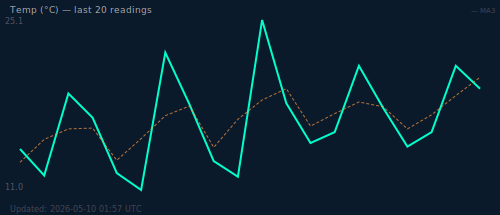

# 🚀 Go Auto Engine

  
  
  
  

  <b>Automated AI Pipeline Dashboard powered by GitHub Actions</b>

---

## 📊 Live Data

- 🌡 Temperature: **13°C**  
- 💨 Wind: **5 km/h**

---

## 🧠 AI Analysis

- 🟢 Status: **HEALTHY**
- 📈 Trend: **Stable**
- 🎯 Score: **31**

---

## 📈 Graph

  

---

## ⚙️ System Pipeline
